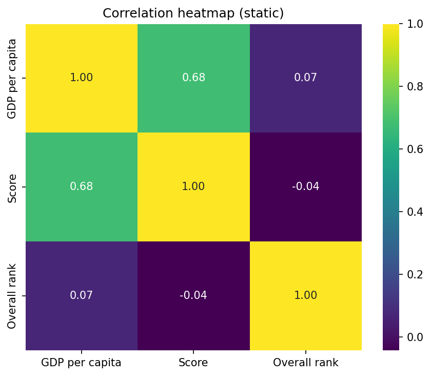
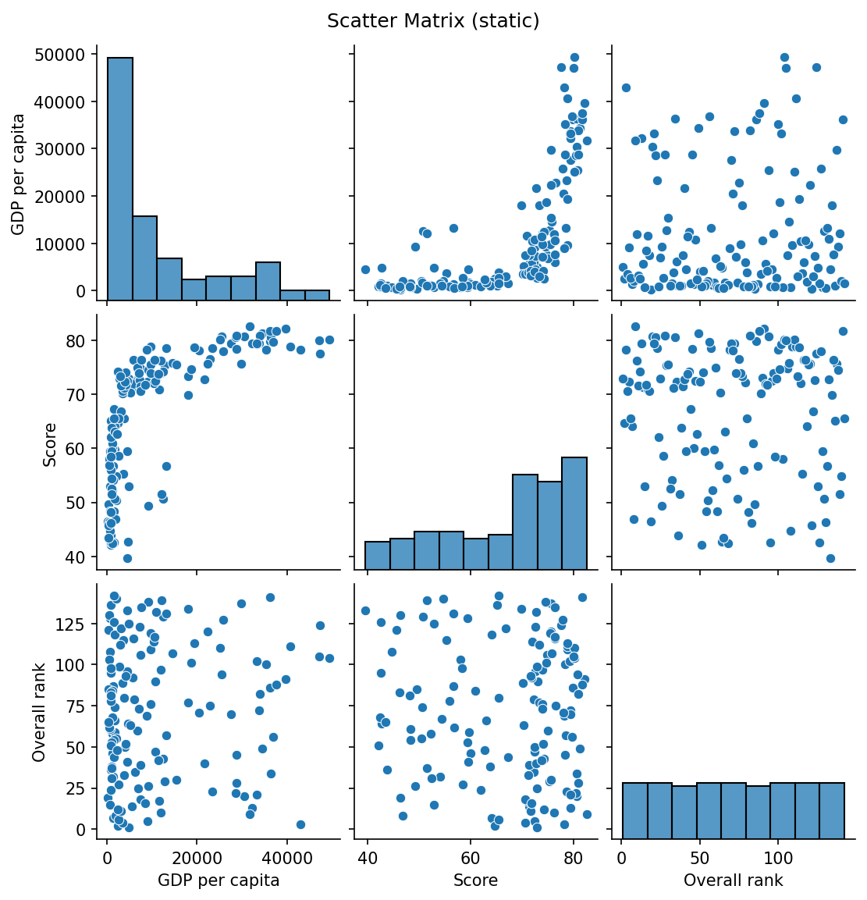

# Data Visualization & Storytelling in Python

This folder contains demo notebooks and figures for data visualization with Plotly, plus static fallbacks using Matplotlib/Seaborn.

## Notebook
- `plotly_png_export_demo_failsafe_v3_staticmpl.ipynb`  
  A robust demo notebook that attempts to export figures to PNG.  
  - If PNG fails (due to missing Chrome/kaleido), it produces static backups (`_static.png`).  
  - It also saves `.html` interactive files as fallbacks.

## Figures

### Figure 1: Happiness Score vs GDP per Capita
- Static preview:  
    
- Interactive (GitHub Pages):  
  [fig1.html](https://a0013333j-png.github.io/data-visualization-labs/Data%20Visualization%20%26%20Storytelling%20in%20Python/fig1.html)

### Figure 2: Correlation Heatmap
- Static preview:  
    
- Interactive (GitHub Pages):  
  [fig2.html](https://a0013333j-png.github.io/data-visualization-labs/Data%20Visualization%20%26%20Storytelling%20in%20Python/fig2.html)

### Figure 3: Scatter Matrix
- Static preview:  
    
- Interactive (GitHub Pages):  
  [fig3.html](https://a0013333j-png.github.io/data-visualization-labs/Data%20Visualization%20%26%20Storytelling%20in%20Python/fig3.html)
